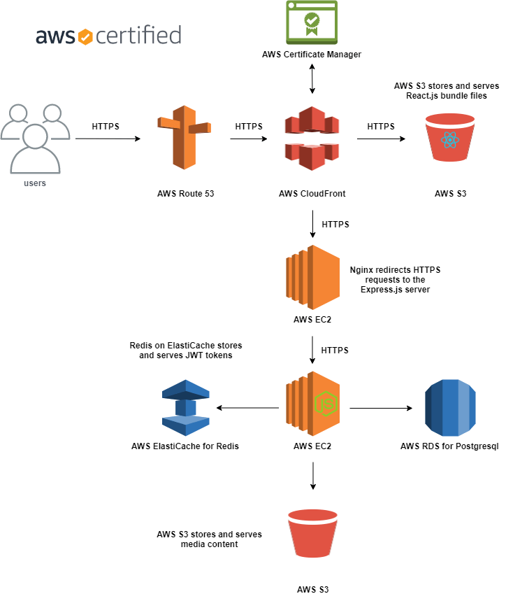

# wjm-api
> Express.js server for http://www.woojoo-market.com

- [Please click it to see the front-end repo](https://github.com/april9288/woojoo-market.com)

- Secure Login System
    - The Express server generates a JSON web token and stores in two locations. One is stored in the database and the other one is delivered to the client's browser and will be stored in the cookie. It'll be safer than storing in the localstorage, which can be accessed by 3rd party code.
    - User's password is hashed with bcrypt. It's a one-way hash password, meaning there is no way guessing the original password with the hashed password. A salt is added to put more complexity into the hashing algorithm. 
    - UUID allows us to avoid exposing primary keys which should be secured all the time. Instread of using primary keys to route a specific page, UUID can be used here to let react-router-dom render corresponding pages. UUID is great because it is a random number that is universially unique. So later on, when it comes to DB sharding, each data row can have a unique ID number to ensure uniqueness. 
    - SendGrid API sends an email to users who forgot their password. The server generates a random password and the password will be sent via email. Later on, user should change their password in the settings page.

- Photo Upload System
    - Multer handles uploaded media files from the client. 
    - Sharp converts format of photos to .webp format, and resizes to 3 different sizes; 550px, 400px, 100px.
    - AWS SDK allows us to access to AWS S3 to store and serve photos.
    - The url of photos is stored in the database.

- Online Payment System
    - Stripe API allows users to sell and buy their items.

- Following/Follower System


## Unit Test
- Performed unit testing with Jest & Supertest
- Currently testing has been done for the login system

## AWS for Scaling


- Registered a domain with AWS Route 53
- Deployed Express server on AWS EC2
- Set up Postgresql on AWS RDS
- Utilized AWS CloundFront for deliverying React.js app
- Stored media files in AWS S3

## Linting and Formatting
- ESLint
- Prettier
- Airbnb Style Guide

## Related Projects
- [React.js - Frontend](https://github.com/april9288/woojoo-market.com)

### How to Run
```
git clone https://github.com/april9288/wjm-api.git
cd wjm-api
npm install
npm start
```

### Requirements
You need to install Nodejs.
You need config files

## Meta Data
Jong-Ho (James) Kim

- [Portfolio](https://april9288.github.io/) - It's my portfolio website
- [Github](https://github.com/april9288) - This is my Github page
- [Linkedin](https://www.linkedin.com/in/james-kim-teamplayer/) - This is my Linkedin page
- [Medium](https://medium.com/@april9288) - I'm a Medium blogger
- april9288@gmail.com
